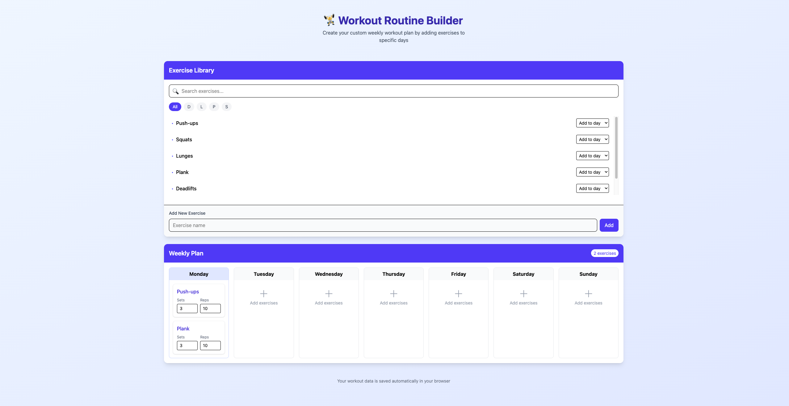

# 🏋️ Workout Routine Builder


A simple and elegant React app that helps you plan your weekly workout routine. Choose exercises, assign them to specific days, and customize sets and reps – all saved locally in your browser.

## 🚀 Features

- 📚 Searchable exercise library
- ➕ Add your own custom exercises
- 🔢 Customize sets and reps for each exercise
- 💾 Data saved in `localStorage` – no login required

## 📸 Preview



## 🛠️ Tech Stack

- **React** with functional components and hooks
- **Tailwind CSS** for modern UI
- **LocalStorage** for persistent data

## 🧪 Testing

This project has comprehensive test coverage using **Jest** and **React Testing Library**.

### Test Coverage

- **Overall Coverage:** ~90%
- **22 passing tests** across unit, component, and integration tests
- **100% coverage** on Planner component
- **100% statement coverage** on ExerciseList component

### Running Tests

```bash
# Run all tests
npm test

# Run tests in watch mode
npm run test:watch

# Run tests with coverage report
npm run test:cov
```

### Test Structure

```
src/
├── __tests__/
│   └── App.test.jsx           # Integration tests
├── components/
│   ├── ExerciseList.test.jsx  # Component tests
│   └── Planner.test.jsx       # Component + interaction tests
└── data/
    └── exercises.test.js      # Unit tests
```

### What's Tested

**Unit Tests:**

- Default exercise data validation

**Component Tests:**

- Rendering with different props
- Conditional rendering (empty states, filtered results)
- Search and filter functionality
- User interactions (clicks, typing, selecting)

**Integration Tests:**

- Adding exercises to specific days
- Removing exercises from routine
- Updating sets and reps
- localStorage persistence across sessions

### Testing Technologies

- **Jest** - Testing framework
- **React Testing Library** - Component testing utilities
- **@testing-library/user-event** - User interaction simulation

## 📦 Installation

1. Clone the repository:

```bash
git clone https://github.com/denichinv/workout-routine-builder.git
cd workout-routine-builder
```

2. Install dependencies:

```bash
npm install
```

3. Start the development server:

```bash
npm run dev
```

4. Open [http://localhost:5173](http://localhost:5173) in your browser

## 🤝 Contributing

Contributions are welcome! Feel free to open issues or submit pull requests.

## 📄 License

MIT License
